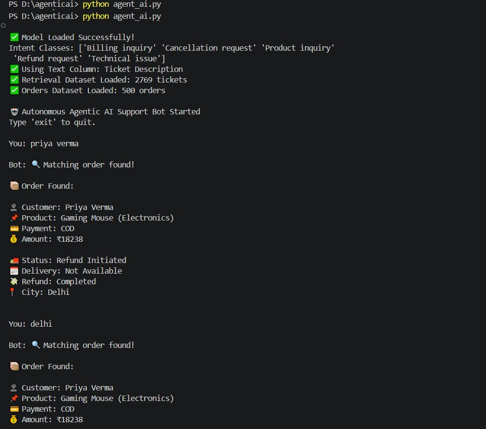
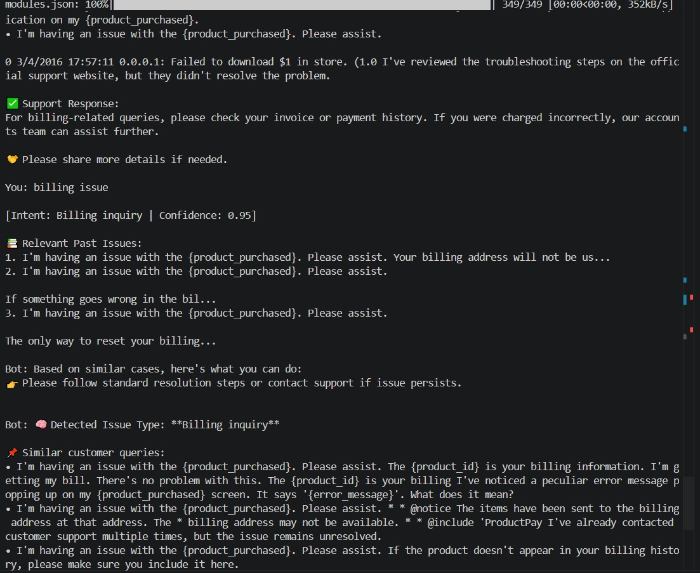
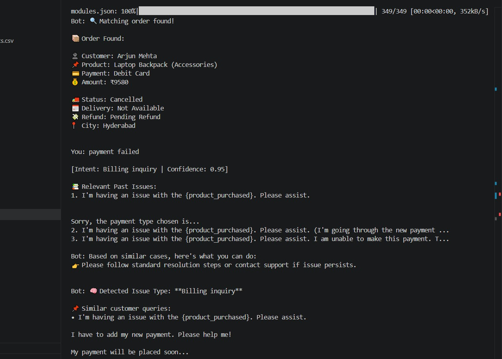

<div align="center">

# 🤖 Agentic AI Customer Support Bot

### Autonomous Customer Support System using ML + RAG + FAISS + Order Tracking


</div>

---

## 📌 Project Overview

An autonomous AI customer support chatbot built using Machine Learning, Retrieval-Augmented Generation (RAG), FAISS vector search, and structured order tracking.

This system simulates a real-world e-commerce support assistant capable of understanding user queries, retrieving relevant past issues, tracking orders, and escalating unresolved problems intelligently.

---

## 📸 Screenshots

### 🔹 Main Chatbot



### 🔹 Order Tracking



### 🔹 RAG Retrieval



---

## 🚀 Key Features

- ✅ Intent Classification using TF-IDF + Logistic Regression  
- ✅ RAG-based Similar Ticket Retrieval  
- ✅ FAISS Vector Search Integration  
- ✅ Order Tracking by Order ID / Name / City  
- ✅ Confidence-Based Escalation System  
- ✅ Ticket Generation for Unresolved Queries  
- ✅ Clean Terminal User Interface  
- ✅ Real Dataset Integration  

---

## 🧠 System Architecture

```text
User Query
   ↓
Intent Detection Agent
   ↓
RAG Retrieval Agent
   ↓
Tool Agent (Order Tracking)
   ↓
Response Generator
   ↓
Escalation Agent (if required)

```

## 📂 Project Structure

```text
Agentic-AI-Customer-Support-Bot/
│
├── agent_ai.py
├── rag_engine.py
├── train_model.py
├── requirements.txt
├── README.md
│
├── data/
│   ├── customer_support_tickets.csv
│   └── orders.csv
│
└── screenshots/
    ├── chatbot.png
    ├── order_tracking.png
    └── rag_output.png
```
## ⚙️ Setup Instructions

###1️⃣ Clone Repository

```bash
git clone https://github.com/khndelwal27/Agentic-AI-Customer-Support-Bot.git
cd Agentic-AI-Customer-Support-Bot
```
###2️⃣ Install Dependencies

```
pip install -r requirements.txt

```

###3️⃣ Run Application

```

python agent_ai.py

```
## 💡 Example Queries

```text
refund status ORD1062
payment failed
billing issue
arjun mehta
delhi

```
## 📬 Contact

For collaborations, project discussions, or opportunities:

- GitHub: https://github.com/khndelwal27
- LinkedIn:https://www.linkedin.com/in/gargi-khandelwal-26045a24b/
- Email: khandelwalgargi9@gmial.com

---

## 🏆 Achievements / Highlights

- Built a real-world AI support automation project
- Implemented RAG + FAISS retrieval pipeline
- Integrated Machine Learning for intent detection
- Used structured datasets for order tracking
- Designed recruiter-ready GitHub documentation

---

## 📜 License

This project is open-source and available under the MIT License.

---

## 🙌 Acknowledgements

Special thanks to:

- Open-source Python ecosystem
- Scikit-learn community
- FAISS developers
- Sentence Transformers team
- GitHub for hosting projects

---

## 🚀 Final Note

This repository showcases practical problem-solving, AI workflow design, and production-style project presentation.

If you found this useful, ⭐ star the repo and share feedback.
